# skala-vue

## 학습환경 구성

### 1. 반응형 데이터 예제

#### 1-1. 학습 목표

- 일반 변수와 반응성 변수의 차이점을 이해한다.

#### 1-2. 작업 파일

- src/App.vue
- src/components/practices/basic/SampleOne.vue

#### 1-3. 결과 화면

1. 최초 접속
   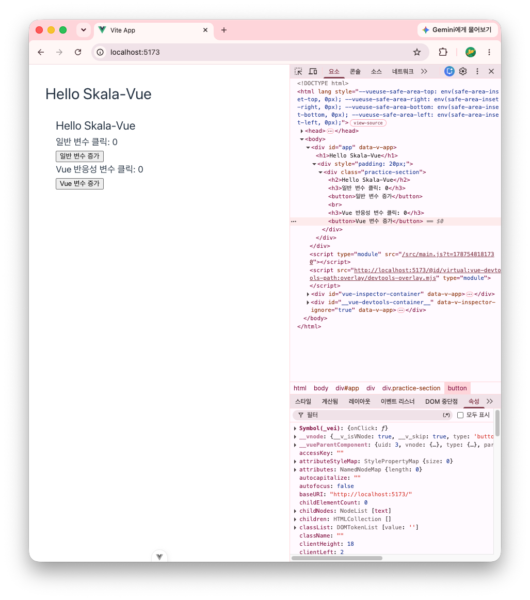
1. 일반 변수 증가 버튼 2회 클릭
   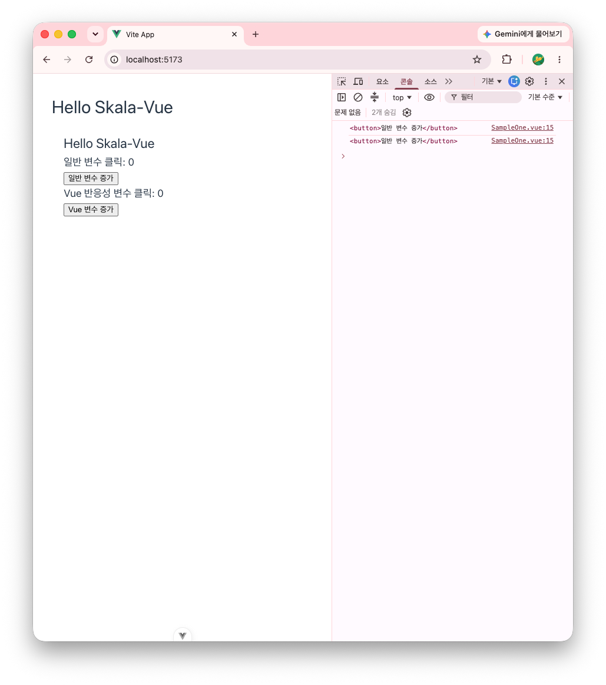
1. 반응성 변수 증가 버튼 3회 클릭
   

---

### 2. JavaScript 표현식을 Text Interpolation에 사용

#### 2-1. 학습 목표

- Text Interpolation에서 JavaScript Expressions (JavaScript 표현식)을 사용할 수도 있다.

#### 2-2. 작업 파일

- src/App.vue
- src/components/practices/basic/SampleTwo.vue

#### 2-3. 결과 화면

1. 자바스크립트 표현식 출력 화면
   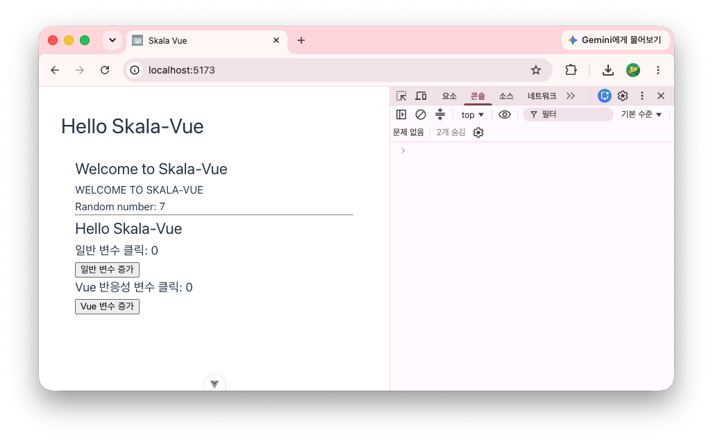

---

## Vue Directive

### 1. `v-html`과 `v-text`

#### 1-1. 학습목표

- 일반 보간법과 v-html 디렉티브 사용의 차이를 이해한다.

#### 1-2. 작업 파일

- src/App.vue
- src/components/practices/basic/VueHtml.vue
- src/components/practices/basic/VueHtmlXss.vue

#### 1-3. 결과화면

1. v-html, v-text 출력화면
   

---

### 2. `v-bind`

#### 2-1. 학습목표

- v-bind를 이용하여 HTML 태그 내부의 속성에 js값을 동적으로 연결할 수 있다.
- v-bind를 이용하여 스타일 시트를 동적으로 관리할 수 있다.
- v-bind를 이용하여 클래스 바인딩처럼 스타일 속성을 제어할 수 있다.
- v-bind 적용 시 연결할 자바스크립트 변수명과 HTML 속성명이 일치할 경우 코드를 단축할 수 있다.

#### 2-2. 작업 파일

- src/App.vue
- src/components/practices/basic/VueBind.vue
- src/components/practices/basic/VueBindClass.vue
- src/components/practices/basic/VueBindStyle.vue
- src/components/practices/basic/VueBindShorthand.vue

#### 2-3. 결과화면

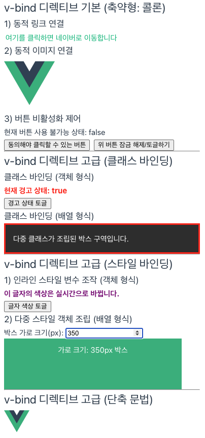

---

### 3. `v-if`, `v-else-if`, `v-else`, `v-show`

#### 3-1. 학습목표

- javascript의 조건식의 결과 여부에 따라 HTML 태그를 화면에 그릴지, 아니면 지울지 결정하는 제어문을 다룰 수 있다.

#### 3-2. 작업파일

- src/App.vue
- src/components/practices/basic/VueIf.vue
- src/components/practices/basic/VueShow.vue

#### 3-3. 결과화면

![v-if v-show] 결과화면(docs/images/practice/0824-05-01.png)

---

### 4. `v-for`

#### 4-1. 학습목표

- 배열이나 객체를 사용해서 뷰에서 반복적으로 렌더링하는 HTML Element를 생성할 수 있다.

#### 4-2. 작업파일

- src/App.vue
- src/components/practices/basic/VueFor.vue

#### 4-3. 결과화면

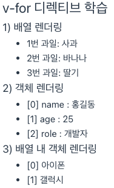

---

### 5. `v-for`

#### 5-1. 학습목표

- 배열이나 객체를 사용해서 뷰에서 반복적으로 렌더링하는 HTML Element를 생성할 수 있다.

#### 5-2. 작업파일

- src/App.vue
- src/components/practices/basic/VueFor.vue

#### 5-3. 결과화면

---

### 6. `v-pre`, `v-cloak`, `v-once`, `v-memo`

#### 6-1. 학습목표

- Vue의 템플릿 컴파일러가 Vue 문법으로 해석(Compile)하지 않고, 써진 그대로 HTML 텍스트로 화면에 표시하라고 지시할 수 있다.
- Vue 어플리케이션의 렌더링 과정에서 데이터 바인딩이 완료되기 전에 Template을 노출하면 {{ message }} 같은 해석 안 된 뼈대 문자열이 그대로 노출되는 현상을 예방할 수 있다.
- 해당 요소와 그 하위 요소는 최초에 한 번만 반응형으로 렌더링하고, 그 이후부터는 데이터가 변경되어도 DOM은 갱신되지 않도록 할 수 있다.
- 지정한 조건(변수)이 바뀔 때만 태그 내부를 업데이트하고, 그렇지 않으면 이전에 그려둔 화면(캐시)을 그대로 재사용할 수 있다.

#### 6-2. 작업파일

- src/App.vue
- src/components/practices/basic/VuePre.vue
- src/components/practices/basic/VueCloak.vue
- src/components/practices/basic/VueOnce.vue
- src/components/practices/basic/VueMemo.vue

#### 6-3. 결과화면

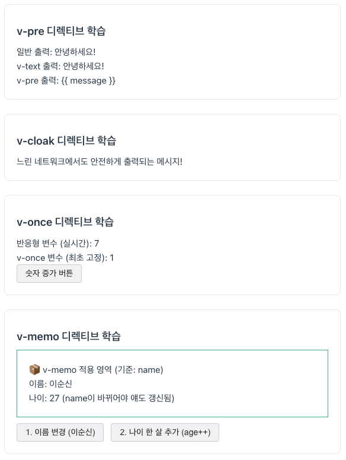

---

## Vue Event Handling

### 1. `v-on` 이벤트 핸들러

#### 1-1. 학습목표

- DOM 요소에 이벤트 리스너를 연결하여 이벤트를 감지하고 처리할 수 있다.

#### 1-2. 작업 파일

- src/App.vue
- src/components/practices/basic/EventBasic.vue

#### 1-3. 결과화면

1. v-on 이벤트 리스너 활용
   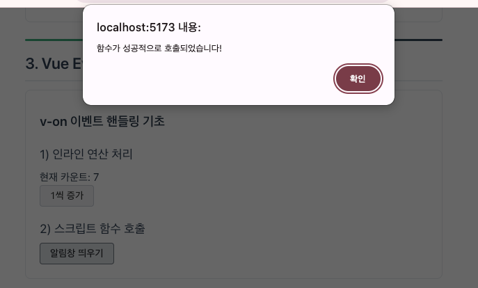

---

### 2. 이벤트 객체

#### 2-1. 학습목표

- 사용자가 웹페이지에서 버튼을 클릭하거나, 키보드를 누르거나, 마우스를 움직이는 등의 "이벤트"를 발생시켰을 때 브라우저가 자동으로 생성하는 객체를 이용하여 이벤트를 관리할 수 있다.

#### 2-2. 작업 파일

- src/App.vue
- src/components/practices/basic/EventObject.vue

#### 2-3. 결과화면

1. v-on 이벤트 객체 예제
   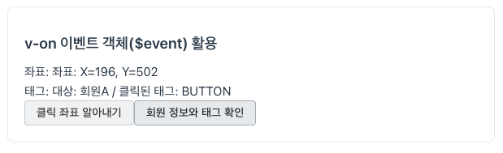

---

### 3. 이벤트 수식어

#### 3-1. 학습목표

- 이벤트 리스너의 기본 동작을 보완하거나 제어하는 데 사용되는 특수 접미어를 활용할 수 있다.

#### 3-2. 작업 파일

- src/App.vue
- src/components/practices/basic/EventModifier.vue

#### 3-3. 결과화면

1. v-on 이벤트 수식어 예제
   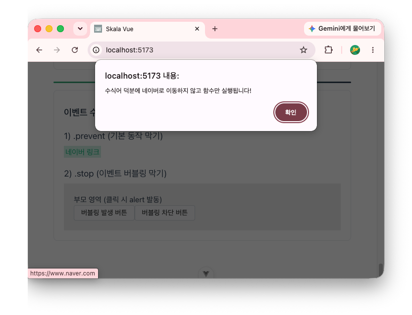

---

## Vue Form Handling

### 1. `v-model` 양방향 바인딩

#### 1-1. 학습목표

- v-bind와 v-on:input을 결합하여 양방향 바인딩이 완성됨을 알 수 있다.
- v-model을 이용하여 간단하게 양방향 바인딩을 구현할 수 있다.

#### 1-2. 작업 파일

- src/App.vue
- src/components/practices/basic/ModelBasic.vue

#### 1-3. 결과화면

1. v-model 활용 양방향 바인딩
   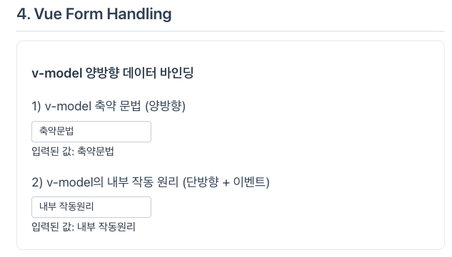

---

### 2. HTML의 Form 요소와 v-model 매핑

#### 2-1. 학습목표

- v-model로 양방향 바인딩을 할 때 HTML 요소의 특성 및 동작 방식과 일치하도록 ref 초기값을 선언해 두어야 예외나 의도치 않은 버그를 막을 수 있다.

#### 2-2. 작업 파일

- src/App.vue
- src/components/practices/basic/ModelForm.vue

#### 2-3. 결과화면

1. Form 요소와 v-model 매핑
   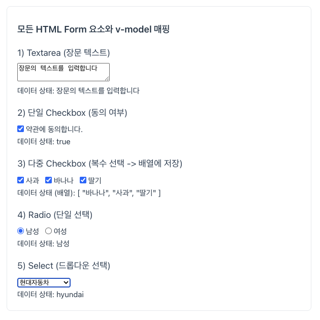

---

### 3. v-model 수식어

#### 3-1. 학습목표

- v-model 수식어를 이용하여 입력 요소의 동작 방식이나 수집되는 데이터 형태를 손쉽게 제어할 수 있다.

#### 3-2. 작업 파일

- src/App.vue
- src/components/practices/basic/ModelModifier.vue

#### 3-3. 결과화면

1. v-model Modifier
   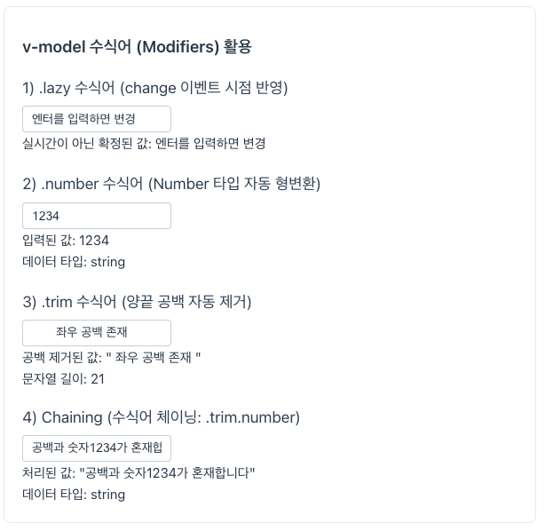

---

## Vue Style

### 1. Vue Style Example

#### 1-1. 학습목표

- style과 style scoped의 차이점을 이해한다.

#### 1-2. 작업 파일

- src/App.vue
- src/components/practices/basic/StyleScoped.vue

#### 1-3. 결과화면

1. style scoped 적용 예제
   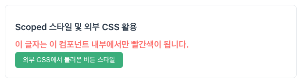

---

## Composition API

### 1. ref() 기초

#### 1-1. 학습목표

- `ref()`로 선언한 변수는 `.value`로 읽고 쓸 수 있다는 걸 안다.
- 문자열, 불리언, 배열, 객체 등 여러 자료형을 ref로 다뤄볼 수 있다.

#### 1-2. 작업 파일

- src/views/practice/Day2View.vue
- src/components/practices/composition/ReactiveRef.vue

#### 1-3. 결과화면

1. ref 기초 예제
   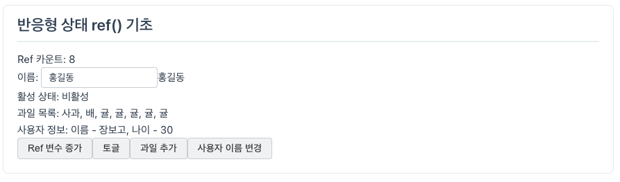

---

### 2. reactive() 특징과 주의점

#### 2-1. 학습목표

- `reactive()`로 객체형 상태를 선언하고 속성에 바로 접근해서 값을 바꿀 수 있다.
- `reactive()`로 선언한 배열에 항목을 추가하거나 지울 수 있다.

#### 2-2. 작업 파일

- src/views/practice/Day2View.vue
- src/components/practices/composition/ReactivePractice.vue

#### 2-3. 결과화면

1. reactive 객체/배열 예제
   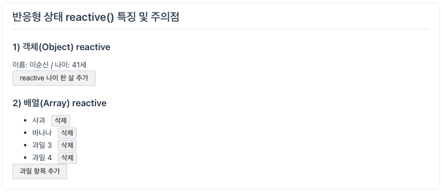

---

### 3. computed() 캐싱 동작

#### 3-1. 학습목표

- 일반 함수는 화면이 리렌더링될 때마다 매번 재실행되지만, `computed`는 의존하는 값이 실제로 바뀔 때만 재연산된다는 걸 콘솔로 직접 비교할 수 있다.

#### 3-2. 작업 파일

- src/views/practice/Day2View.vue
- src/components/practices/composition/ComputedBasic.vue

#### 3-3. 결과화면

1. computed 캐싱 비교 예제
   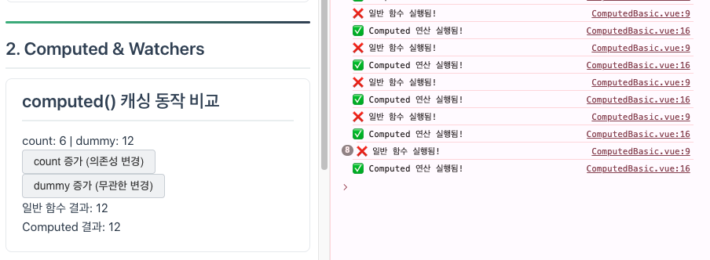

---

### 4. watch() 기본

#### 4-1. 학습목표

- `watch`로 특정 반응형 변수를 감시하고 이전 값과 새 값을 동시에 받아 처리할 수 있다.

#### 4-2. 작업 파일

- src/views/practice/Day2View.vue
- src/components/practices/composition/WatchersBasic.vue

#### 4-3. 결과화면

1. watch 기본 예제
   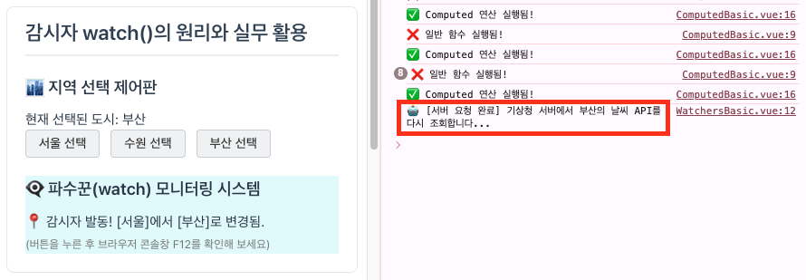

---

### 5. 여러 변수 동시 감시

#### 5-1. 학습목표

- 배열로 여러 개의 ref를 묶어서 `watch` 하나로 동시에 감시할 수 있다.

#### 5-2. 작업 파일

- src/views/practice/Day2View.vue
- src/components/practices/composition/WatchersMulti.vue

#### 5-3. 결과화면

1. 여러 변수 동시 감시 예제
   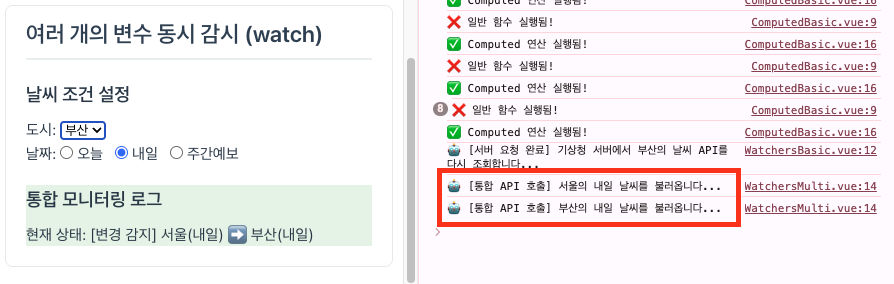

---

### 6. ref 객체 감시와 deep 옵션

#### 6-1. 학습목표

- ref로 감싼 객체는 그냥 watch하면 감지가 안 된다는 걸 확인하고, `{ deep: true }`로 해결할 수 있다.
- 화살표 함수로 특정 속성만 콕 집어 감시하면 이전 값도 정확히 추적된다는 걸 확인할 수 있다.

#### 6-2. 작업 파일

- src/views/practice/Day2View.vue
- src/components/practices/composition/WatchersDeep.vue

#### 6-3. 결과화면

1. deep 옵션과 타겟 감시 비교
   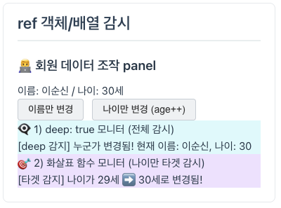

---

### 7. reactive 데이터 watch 규칙

#### 7-1. 학습목표

- `reactive()`로 만든 객체는 변수명 그대로 watch해도 deep 감시가 자동으로 걸리지만, 이전 값도 같이 바뀌어버리는 함정이 있다는 걸 확인할 수 있다.
- 화살표 함수로 특정 속성만 감시하면 진짜 과거 값을 보존할 수 있다.

#### 7-2. 작업 파일

- src/views/practice/Day2View.vue
- src/components/practices/composition/WatchersReactive.vue

#### 7-3. 결과화면

1. reactive watch 규칙 예제
   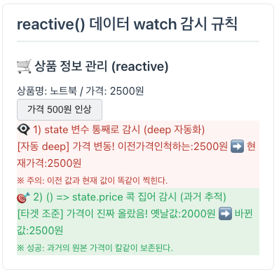

---

### 8. ref 배열의 특정 인덱스 감시

#### 8-1. 학습목표

- ref 배열의 특정 인덱스를 화살표 함수로 감시할 수 있다.
- 배열 요소가 객체일 때는 `{ deep: true }`가 없으면 내부 속성 변화가 감지되지 않는다는 걸 확인할 수 있다.

#### 8-2. 작업 파일

- src/views/practice/Day2View.vue
- src/components/practices/composition/WatchersRefArray.vue

#### 8-3. 결과화면

1. ref 배열 인덱스 감시 예제
   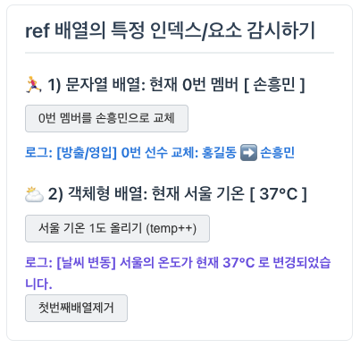

---

### 9. reactive 배열 감시와 스냅샷

#### 9-1. 학습목표

- reactive 배열을 그대로 watch하면 이전 배열과 현재 배열이 같이 바뀌어버리는 문제를 확인할 수 있다.
- 전개 연산자로 스냅샷(복사본)을 만들어 감시하면 과거 배열 상태를 제대로 보존할 수 있다.

#### 9-2. 작업 파일

- src/views/practice/Day2View.vue
- src/components/practices/composition/WatchersReactiveArray.vue

#### 9-3. 결과화면

1. reactive 배열 스냅샷 감시 예제
   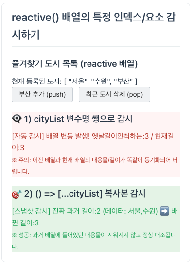

---

### 10. watchEffect 자동 감시

#### 10-1. 학습목표

- `watchEffect`는 감시 대상을 따로 지정하지 않아도 콜백 안에서 참조한 반응형 변수를 자동으로 추적한다는 걸 확인할 수 있다.
- 화면이 처음 켜질 때도 1번은 즉시 실행된다는 특징을 확인할 수 있다.

#### 10-2. 작업 파일

- src/views/practice/Day2View.vue
- src/components/practices/composition/WatchersWatchEffect.vue

#### 10-3. 결과화면

1. watchEffect 자동 감시 예제
   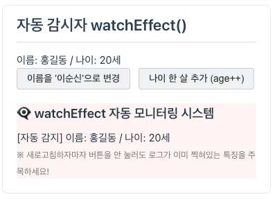

---

## Vue Components

### 1. Lifecycle Hook

#### 1-1. 학습목표

- `onMounted`, `onUpdated`, `onUnmounted` 훅이 각각 어느 시점에 실행되는지 콘솔로 확인할 수 있다.
- 컴포넌트가 사라질 때 타이머 같은 자원을 정리하지 않으면 메모리 누수가 생긴다는 걸 확인하고, `onUnmounted`에서 직접 정리할 수 있다.

#### 1-2. 작업 파일

- src/views/practice/Day3View.vue
- src/components/practices/component/LifecycleParent.vue
- src/components/practices/component/LifecycleChild.vue

#### 1-3. 결과화면

1. Lifecycle Hook 예제
   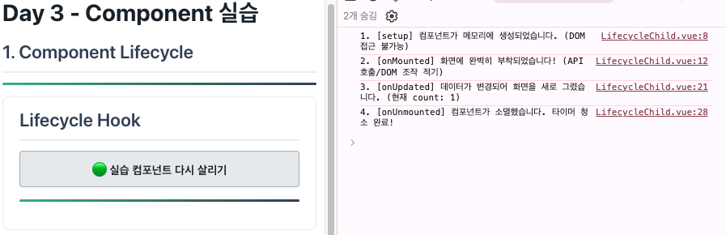

---

### 2. Props & Emits

#### 2-1. 학습목표

- `defineProps`로 부모의 데이터를 자식이 전달받을 수 있다.
- `defineEmits`로 자식에서 부모로 커스텀 이벤트를 발생시켜서 데이터를 되돌려줄 수 있다.

#### 2-2. 작업 파일

- src/views/practice/Day3View.vue
- src/components/practices/component/PropsEmitsParent.vue
- src/components/practices/component/PropsEmitsChild.vue

#### 2-3. 결과화면

1. Props & Emits 예제
   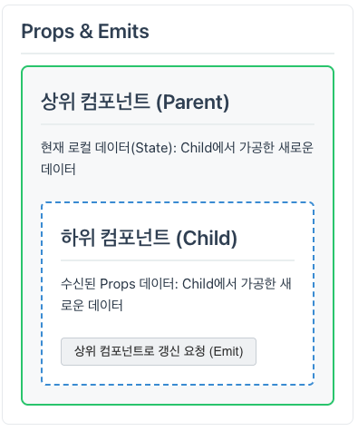

---

### 3. Default Slot

#### 3-1. 학습목표

- `slot`으로 자식 컴포넌트 내부에 부모가 원하는 마크업을 그대로 주입할 수 있다.
- 슬롯에 아무것도 안 넣으면 자식이 정의해둔 기본 콘텐츠가 대신 보인다는 걸 확인할 수 있다.

#### 3-2. 작업 파일

- src/views/practice/Day3View.vue
- src/components/practices/component/SlotDefaultParent.vue
- src/components/practices/component/SlotDefaultChild.vue

#### 3-3. 결과화면

1. Default Slot 예제
   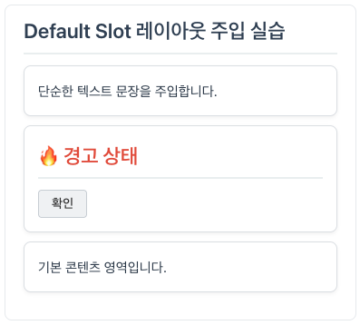

---

### 4. Named Slot

#### 4-1. 학습목표

- 슬롯이 여러 개 필요할 때 `v-slot:이름`(또는 `#이름`)으로 위치를 지정해서 나눠 넣을 수 있다.

#### 4-2. 작업 파일

- src/views/practice/Day3View.vue
- src/components/practices/component/SlotNamedParent.vue
- src/components/practices/component/SlotNamedChild.vue

#### 4-3. 결과화면

1. Named Slot 예제
   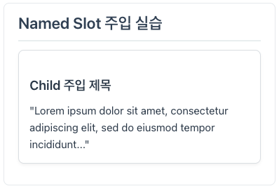

---

### 5. Scoped Slot

#### 5-1. 학습목표

- 자식 컴포넌트가 갖고 있는 데이터를 `slot` 바인딩으로 부모에게 역으로 전달할 수 있다.
- `v-slot="변수명"`으로 자식이 넘겨준 데이터를 부모 템플릿에서 받아 쓸 수 있다.

#### 5-2. 작업 파일

- src/views/practice/Day3View.vue
- src/components/practices/component/SlotScopedParent.vue
- src/components/practices/component/SlotScopedChild.vue

#### 5-3. 결과화면

1. Scoped Slot 예제
   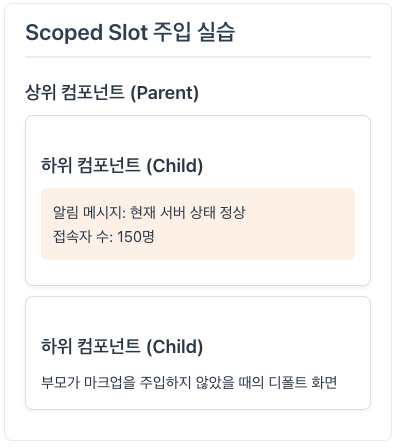

---

## Pinia Store

### 1. Counter Store

#### 1-1. 학습목표

- Pinia의 setup 스토어 문법으로 상태(`count`)·게터(`doubleCount`)·액션(`increment`)을 정의하고 컴포넌트에서 꺼내 쓸 수 있다.

#### 1-2. 작업 파일

- src/stores/counter.js
- src/components/practices/library/StoreCounter.vue
- src/views/practice/Day4View.vue

#### 1-3. 결과화면

1. Store 실습 화면 — 카운트 증가/2배 값 확인
   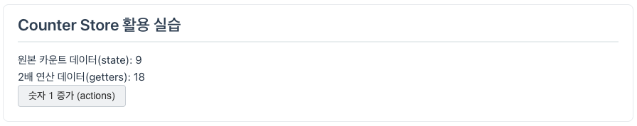

---

## Axios

### 1. Axios Weather

#### 1-1. 학습목표

- axios로 OpenWeatherMap 현재 날씨 API를 호출하고, 로딩 상태와 try/catch/finally로 에러 처리를 할 수 있다.

#### 1-2. 작업 파일

- src/components/practices/library/AxiosWeather.vue
- src/views/practice/Day4View.vue

#### 1-3. 결과화면

1. Axios 날씨 예제 — 버튼 클릭 후 실제 데이터 표시
   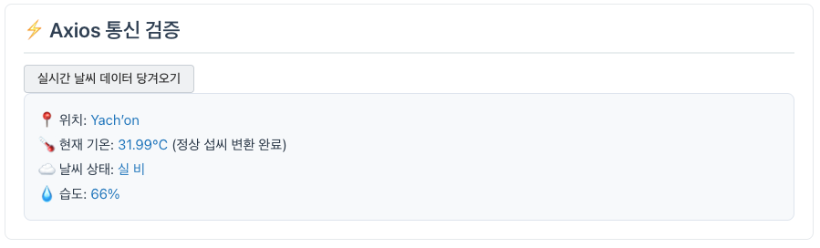

### 2. Axios JSON CRUD

#### 2-1. 학습목표

- JSONPlaceholder API를 대상으로 axios GET/POST/PUT/DELETE를 호출해 CRUD를 구현할 수 있다.

#### 2-2. 작업 파일

- src/components/practices/library/AxiosJson.vue
- src/views/practice/Day4View.vue

#### 2-3. 결과화면

1. Axios JSON CRUD 예제
   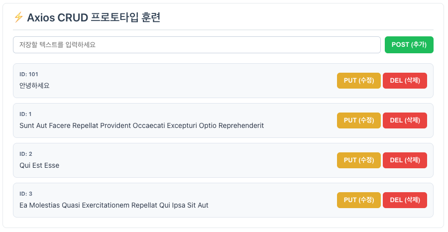

---

## UI Libraries

### 1. 회원가입 Form & 인풋 제어

#### 1-1. 학습목표

- `el-input`, `el-switch`, `el-form`으로 입력폼을 구성하고, `ElMessage`로 유효성 검사 결과를 보여줄 수 있다.

#### 1-2. 작업 파일

- src/components/practices/library/ElementRegisterForm.vue
- src/views/practice/Day4View.vue

#### 1-3. 결과화면

1. 회원가입 Form 예제 — 이메일 형식/약관 동의 검증
   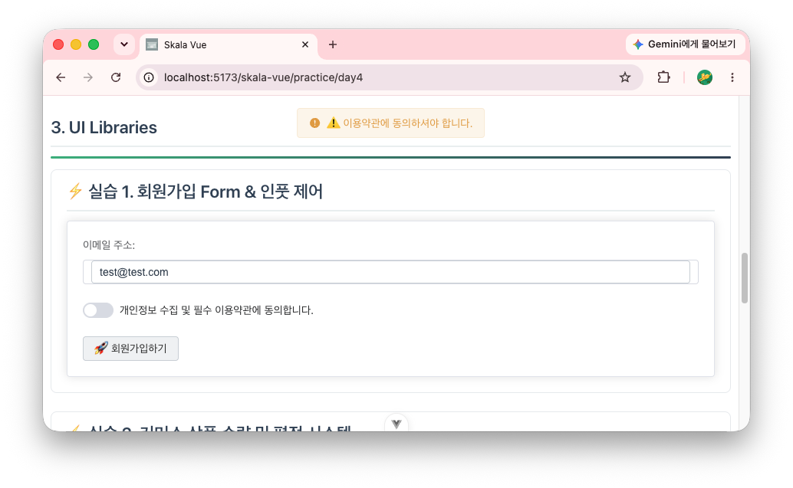

### 2. 커머스 상품 수량 및 평점 시스템

#### 2-1. 학습목표

- `el-input-number`로 수량을, `el-rate`로 평점을 입력받아 실시간으로 반영할 수 있다.

#### 2-2. 작업 파일

- src/components/practices/library/ElementCommerceRate.vue
- src/views/practice/Day4View.vue

#### 2-3. 결과화면

1. 커머스 수량/평점 예제
   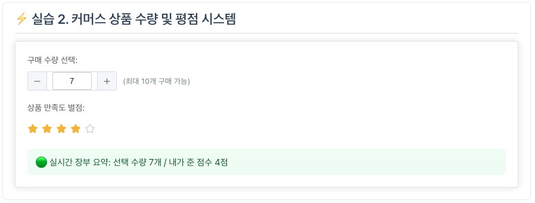

### 3. 시스템 피드백 & 프로그레스 인터랙션

#### 3-1. 학습목표

- `ElMessageBox.confirm`으로 삭제 같은 위험한 동작을 확인받고, `el-progress`로 진행률을 시각화할 수 있다.

#### 3-2. 작업 파일

- src/components/practices/library/ElementFeedbackProgress.vue
- src/views/practice/Day4View.vue

#### 3-3. 결과화면

1. 삭제 확인 + 프로그레스바 예제
   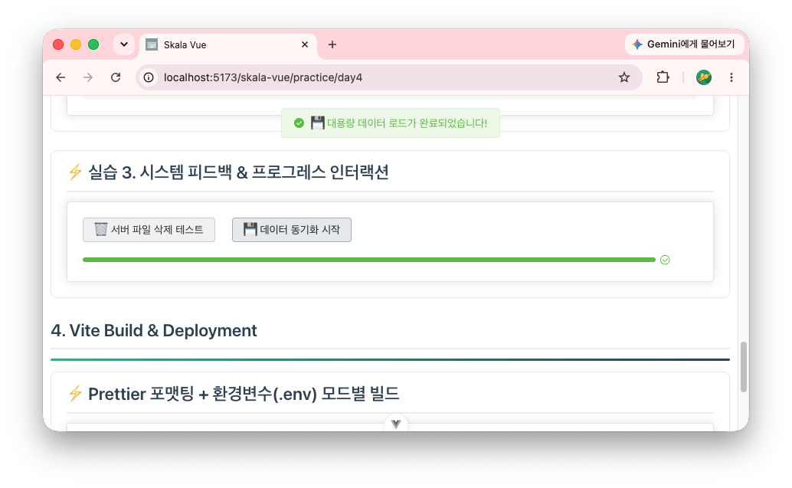

---

## Vite Build & Deployment

### 1. Prettier 포맷팅 + 환경변수 모드별 빌드

#### 1-1. 학습목표

- `npm run format`(Prettier)으로 정렬/인덴트가 엉망인 코드를 자동 정리할 수 있다.
- `.env.staging`/`.env.production`을 만들어 `vite build --mode staging`처럼 모드별로 다른 `import.meta.env` 값을 빌드에 반영할 수 있다.
- `npm run build` 후 생성된 `dist/` 폴더와 `dist/assets/`의 산출물을 확인할 수 있다.

#### 1-2. 작업 파일

- .env.staging
- .env.production
- package.json (`build:staging` 스크립트)
- src/components/practices/library/ViteEnvDemo.vue

#### 1-3. 결과화면

1. Prettier 정리된 코드 + 모드별 API URL 표시
   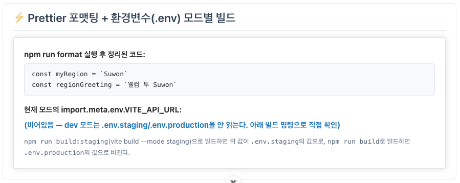
