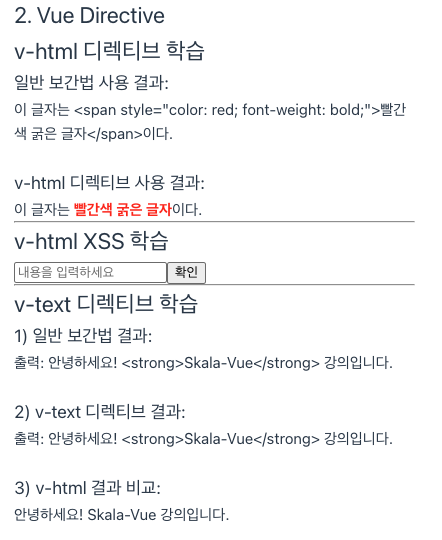
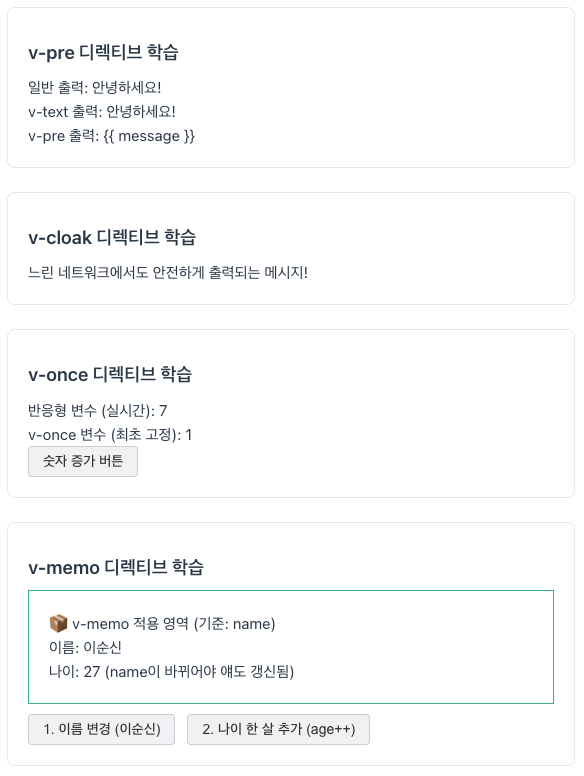

# skala-vue

## 학습환경 구성

### 1. 반응형 데이터 예제

#### 1-1. 학습 목표

- 일반 변수와 반응성 변수의 차이점을 이해한다.

#### 1-2. 작업 파일

- src/App.vue
- src/components/practices/basic/SampleOne.vue

#### 1-3. 결과 화면

1. 최초 접속
   
1. 일반 변수 증가 버튼 2회 클릭
   
1. 반응성 변수 증가 버튼 3회 클릭
   

### 2. JavaScript 표현식을 Text Interpolation에 사용

#### 2-1. 학습 목표

- Text Interpolation에서 JavaScript Expressions (JavaScript 표현식)을 사용할 수도 있다.

#### 2-2. 작업 파일

- src/App.vue
- src/components/practices/basic/SampleTwo.vue

#### 2-3. 결과 화면

1. 자바스크립트 표현식 출력 화면
   

## Vue Directive

### 1. `v-html`과 `v-text`

#### 1-1. 학습목표

- 일반 보간법과 v-html 디렉티브 사용의 차이를 이해한다.

#### 1-2. 작업 파일

- src/App.vue
- src/components/practices/basic/VueHtml.vue
- src/components/practices/basic/VueHtmlXss.vue

#### 1-3. 결과화면

1. v-html, v-text 출력화면
   

### 2. `v-bind`

#### 2-1. 학습목표

- v-bind를 이용하여 HTML 태그 내부의 속성에 js값을 동적으로 연결할 수 있다.
- v-bind를 이용하여 스타일 시트를 동적으로 관리할 수 있다.
- v-bind를 이용하여 클래스 바인딩처럼 스타일 속성을 제어할 수 있다.
- v-bind 적용 시 연결할 자바스크립트 변수명과 HTML 속성명이 일치할 경우 코드를 단축할 수 있다.

#### 2-2. 작업 파일

- src/App.vue
- src/components/practices/basic/VueBind.vue
- src/components/practices/basic/VueBindClass.vue
- src/components/practices/basic/VueBindStyle.vue
- src/components/practices/basic/VueBindShorthand.vue

#### 2-3. 결과화면

### 3. `v-if`, `v-else-if`, `v-else`, `v-show`

#### 3-1. 학습목표

- javascript의 조건식의 결과 여부에 따라 HTML 태그를 화면에 그릴지, 아니면 지울지 결정하는 제어문을 다룰 수 있다.

#### 3-2. 작업파일

- src/App.vue
- src/components/practices/basic/VueIf.vue
- src/components/practices/basic/VueShow.vue

#### 3-3. 결과화면

![v-if v-show] 결과화면(docs/images/0824-05-01.png)

### 4. `v-for`

#### 4-1. 학습목표

- 배열이나 객체를 사용해서 뷰에서 반복적으로 렌더링하는 HTML Element를 생성할 수 있다.

#### 4-2. 작업파일

- src/App.vue
- src/components/practices/basic/VueFor.vue

#### 4-3. 결과화면

### 5. `v-for`

#### 5-1. 학습목표

- 배열이나 객체를 사용해서 뷰에서 반복적으로 렌더링하는 HTML Element를 생성할 수 있다.

#### 5-2. 작업파일

- src/App.vue
- src/components/practices/basic/VueFor.vue

#### 5-3. 결과화면

### 6. `v-pre`, `v-cloak`, `v-once`, `v-memo`

#### 6-1. 학습목표

- Vue의 템플릿 컴파일러가 Vue 문법으로 해석(Compile)하지 않고, 써진 그대로 HTML 텍스트로 화면에 표시하라고 지시할 수 있다.
- Vue 어플리케이션의 렌더링 과정에서 데이터 바인딩이 완료되기 전에 Template을 노출하면 {{ message }} 같은 해석 안 된 뼈대 문자열이 그대로 노출되는 현상을 예방할 수 있다.
- 해당 요소와 그 하위 요소는 최초에 한 번만 반응형으로 렌더링하고, 그 이후부터는 데이터가 변경되어도 DOM은 갱신되지 않도록 할 수 있다.
- 지정한 조건(변수)이 바뀔 때만 태그 내부를 업데이트하고, 그렇지 않으면 이전에 그려둔 화면(캐시)을 그대로 재사용할 수 있다.

#### 6-2. 작업파일

- src/App.vue
- src/components/practices/basic/VuePre.vue
- src/components/practices/basic/VueCloak.vue
- src/components/practices/basic/VueOnce.vue
- src/components/practices/basic/VueMemo.vue

#### 6-3. 결과화면

