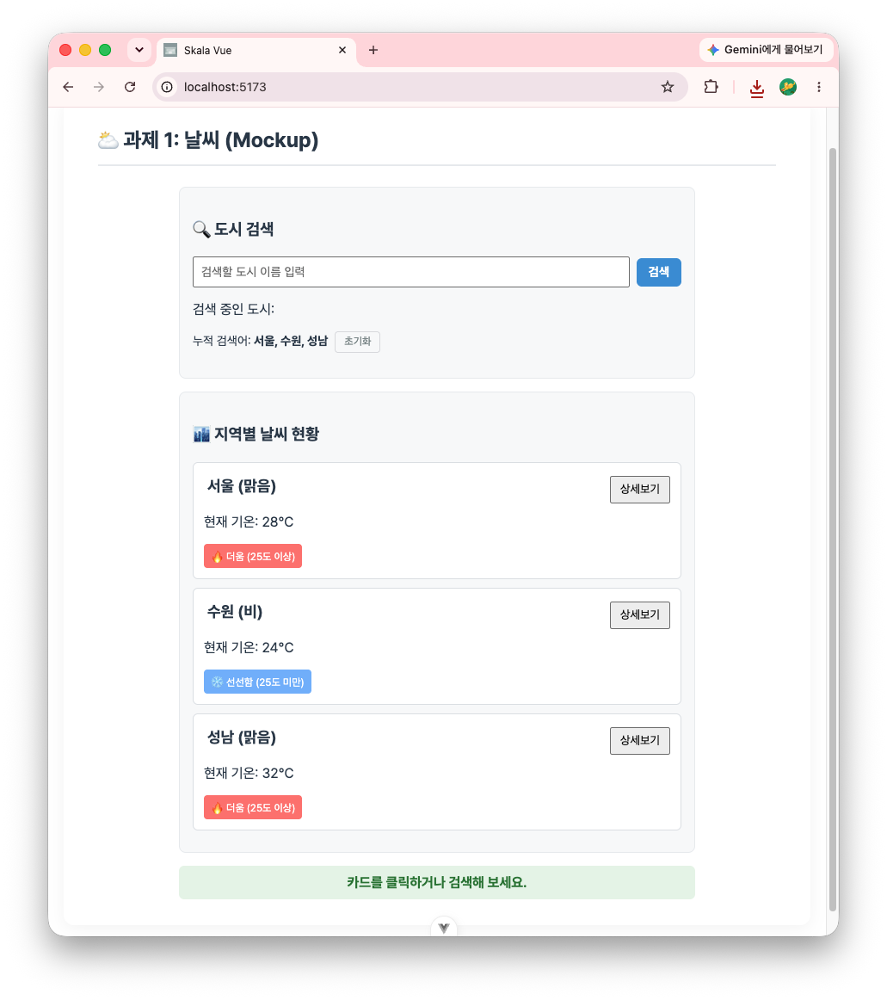
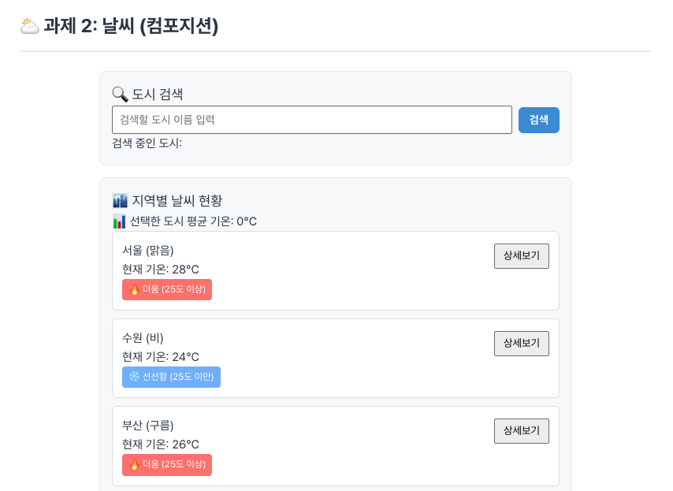
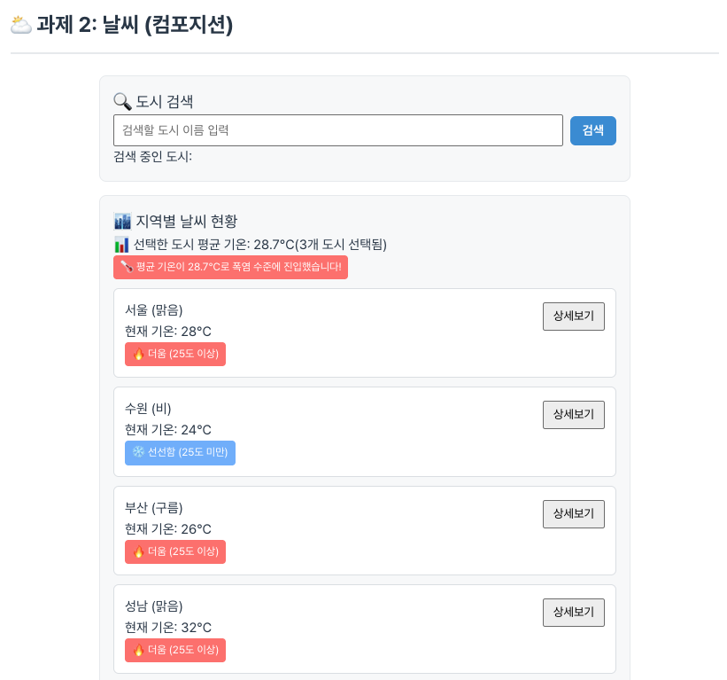
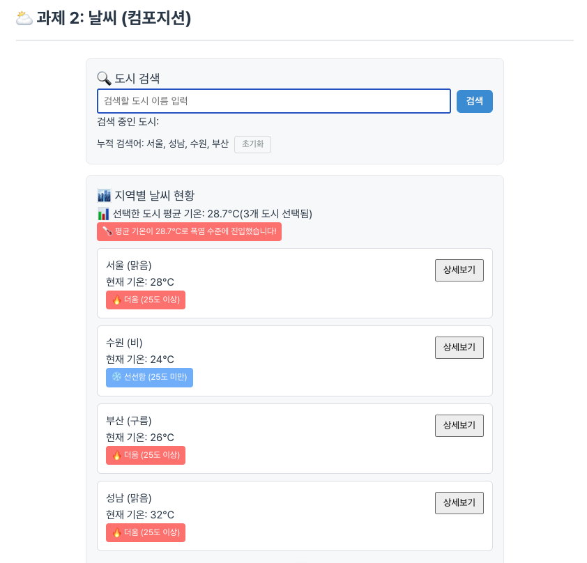
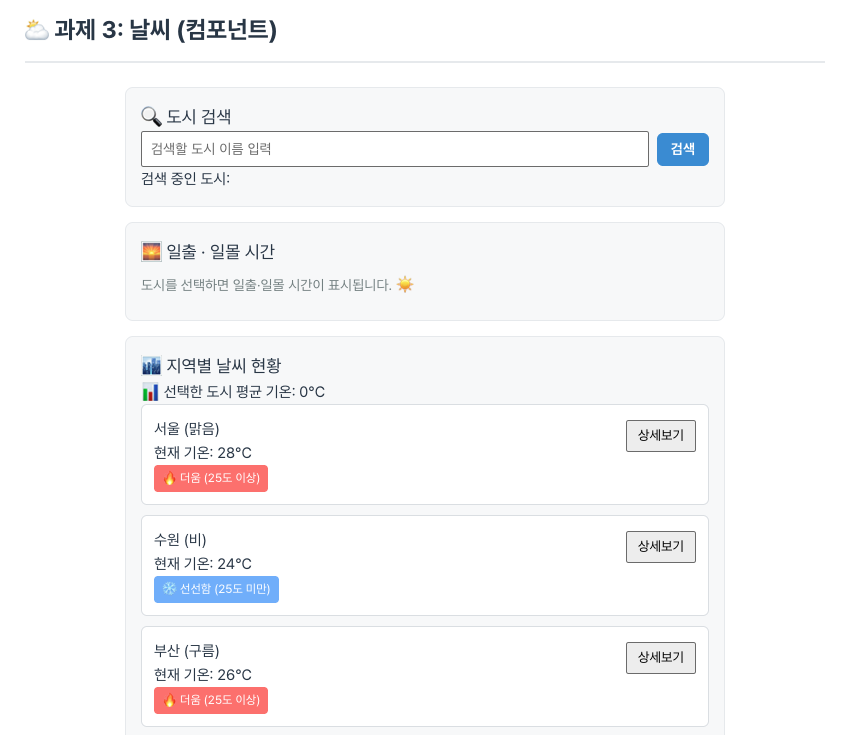
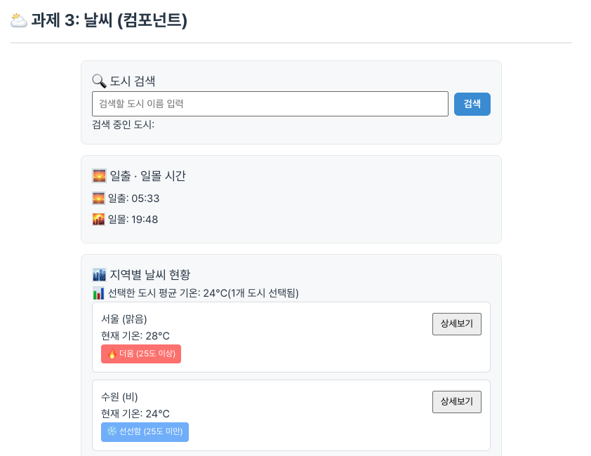
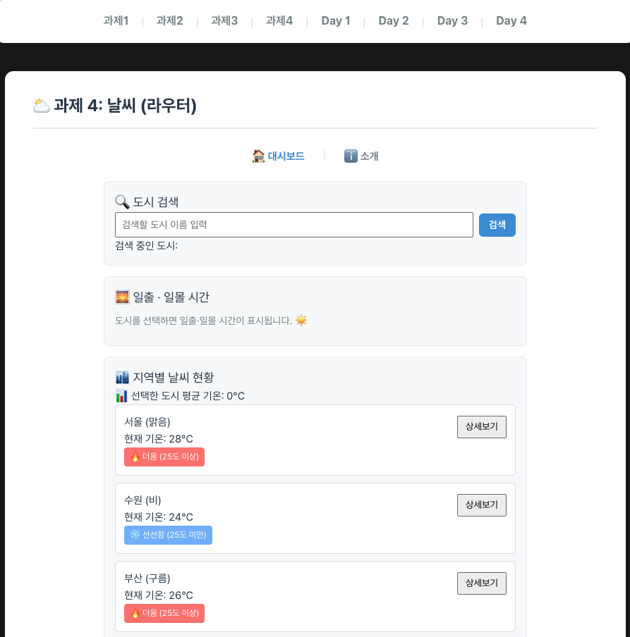
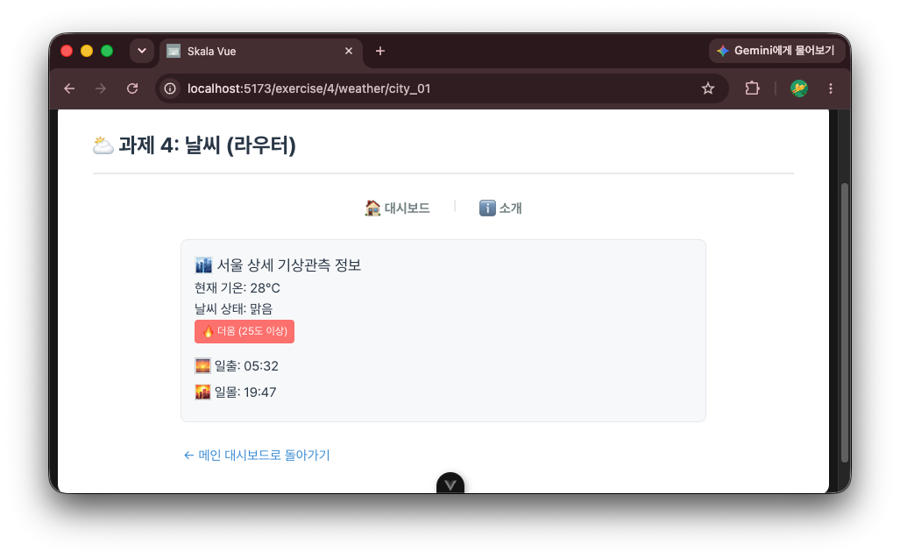
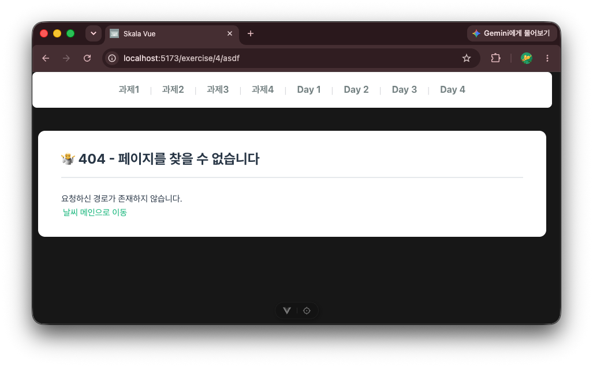

# skala-vue 과제 작성

## weather 앱 구현

### 1. WeatherMockup

#### 1-1. 학습 목표

- `v-for`를 이용하여 날씨. 데이터 배열을 날씨 카드로 반복 출력할 수 있다.
- `v-if`를 이용하여 기온에 맞게 날씨를 라벨링할 수 있다.
- `v-bind`, `v-on`을 이용하여 양방향 바인딩 및 한글 처리를 할 수 있다.
- 템플릿 리터럴과 `v-on` modifier를 이용하여 window alert를 버블링 없이 띄울 수 있다.
- (추가) 검색어를 여러 개 눌러도 계속 쌓이게 만들고, 중복은 걸러지게 했다. 한글 아닌 글자 들어오면 자동으로 지워지게도 해봤다.

#### 1-2. 작업 파일

- src/AppExercise.vue
- src/components/exercise/WeatherMockup.vue

#### 1-3. 결과 화면

1. WeatherMockup 진입화면
   
1. 검색어 여러 개 누적하고 초기화 버튼으로 리셋
   

### 2. WeatherComposition

#### 2-1. 학습 목표

- `computed`를 이용하여 검색어에 맞게 필터링된 리스트를 만들 수 있다.
- `watch`를 이용하여 특정 반응형 변수의 변화를 감지하고 후속 처리를 할 수 있다.
- `watchEffect`를 이용하면 감시 대상을 따로 지정하지 않아도 콜백 안에서 참조한 변수를 자동으로 추적한다는 걸 알 수 있다.
- (추가) 카드를 누른 도시들을 따로 모아서 평균 기온을 계산하고, 28도를 넘나드는 순간에만 폭염 배너가 뜨게 만들어봤다.

#### 2-2. 작업 파일

- src/components/exercise/WeatherComposition.vue

#### 2-3. 결과 화면

1. WeatherComposition 진입화면
   
1. 도시 여러 개 클릭해서 평균 기온과 폭염 배너 뜨는 것 확인
   
1. 검색어 누적 및 초기화
   

### 3. WeatherParent (컴포넌트 분리)

#### 3-1. 학습 목표

- 한 화면에 몰려있던 코드를 `BaseDashboardCard`, `SearchBar`, `WeatherCard`로 역할별로 나눌 수 있다.
- `props`와 `emit`으로 부모-자식 컴포넌트끼리 데이터를 주고받을 수 있다.
- `slot`으로 카드 레이아웃을 공통 컴포넌트로 재사용할 수 있다.
- (추가) 도시를 선택하면 일출·일몰 시간을 보여주는 `SunriseSunsetCard`를 새로 만들어서 붙였다.

#### 3-2. 작업 파일

- src/components/exercise/WeatherParent.vue
- src/components/exercise/BaseDashboardCard.vue
- src/components/exercise/SearchBar.vue
- src/components/exercise/WeatherCard.vue
- src/components/exercise/SunriseSunsetCard.vue

#### 3-3. 결과 화면

1. 컴포넌트 분리된 대시보드 화면
   
1. 도시 선택 후 일출·일몰 카드 확인
   

### 4. Weather Router

#### 4-1. 학습 목표

- Vue Router의 중첩 라우트(nested route)로 `/`, `/about`, `/weather/:cityId` 하위 경로를 구성할 수 있다.
- `router.push`로 window.alert 대신 실제 페이지 이동(상세보기)을 구현할 수 있다.
- 동적 세그먼트(`:cityId`)로 넘어온 값을 `route.params`로 받아서 해당 도시 상세 정보를 보여줄 수 있다.
- catch-all 라우트로 존재하지 않는 경로에 404 페이지를 띄울 수 있다.
- 라우트 컴포넌트를 지연 로딩(`() => import(...)`)으로 불러올 수 있다.
- (추가) 과제1~4를 전부 한 페이지에 쌓아두니까 너무 지저분해져서, practice의 Day1~4처럼 `/exercise/1`~`/exercise/4`로 아예 페이지를 나눠버렸다.

#### 4-2. 작업 파일

- src/router/index.js
- src/views/exercise/Exercise1View.vue
- src/views/exercise/Exercise2View.vue
- src/views/exercise/Exercise3View.vue
- src/views/exercise/Exercise4View.vue
- src/views/WeatherRouterHomeView.vue
- src/views/WeatherAboutView.vue
- src/views/WeatherDetailView.vue
- src/views/NotFoundView.vue

#### 4-3. 결과 화면

1. 과제4 대시보드 화면
   
1. 상세보기 클릭 후 도시 상세 페이지로 이동
   
1. 소개 페이지
   
1. 존재하지 않는 경로 접속 시 404 페이지
   
