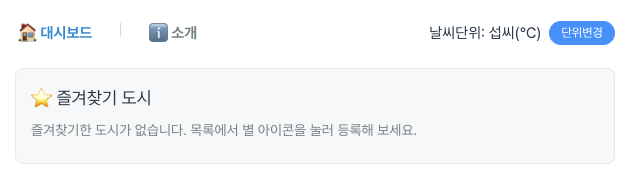
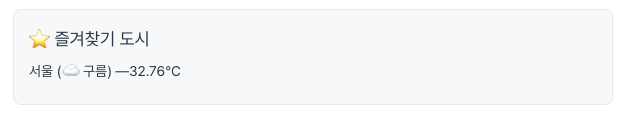
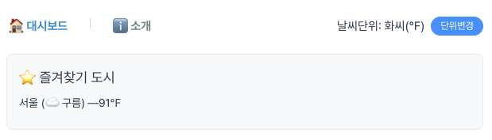
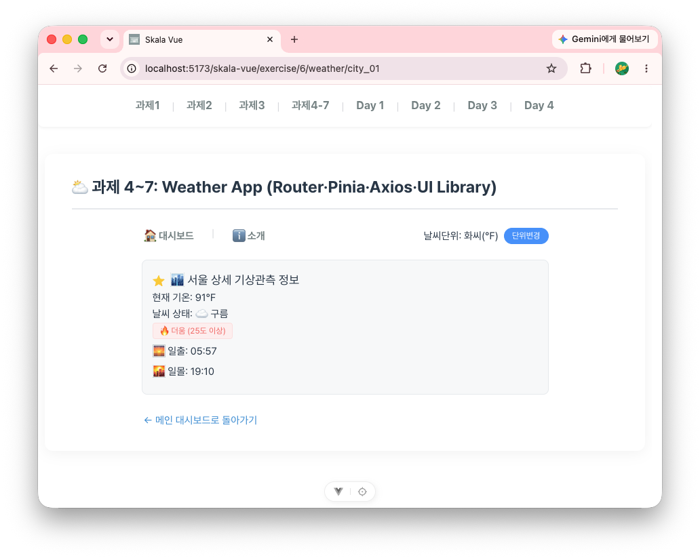
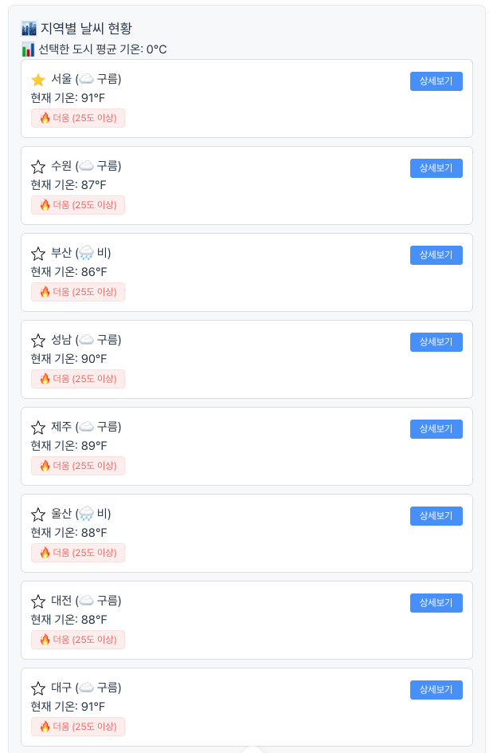
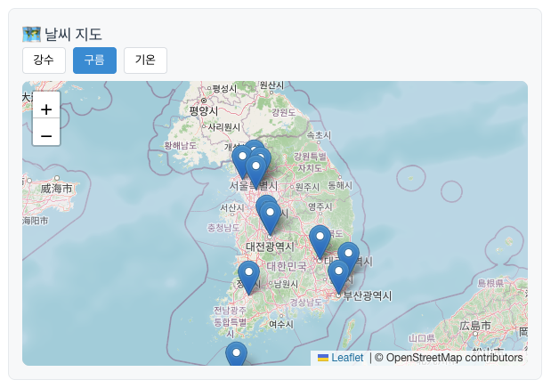
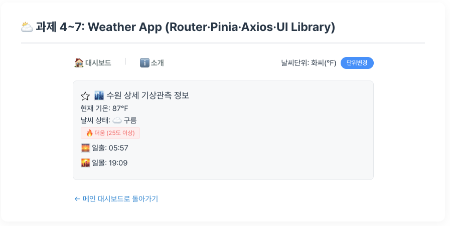
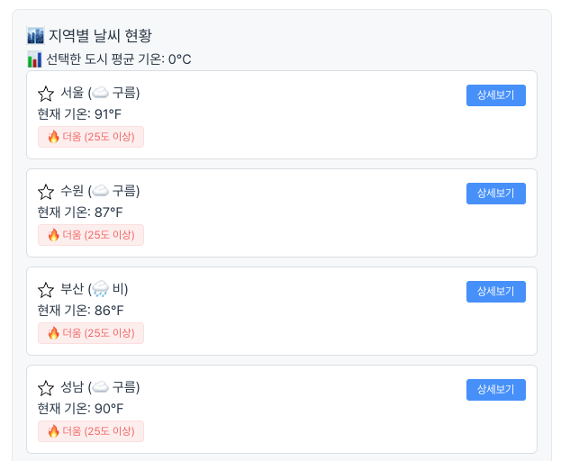
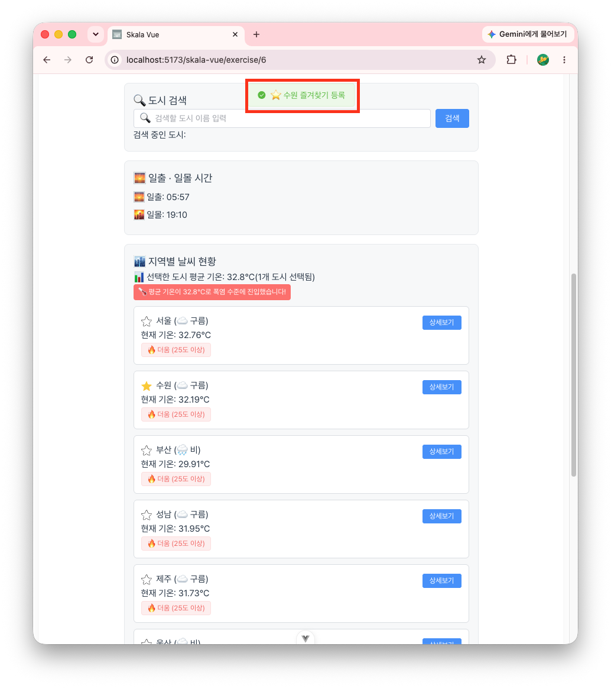

# skala-vue 과제 작성

## weather 앱 구현

### 1. WeatherMockup

#### 1-1. 학습 목표

- `v-for`를 이용하여 날씨. 데이터 배열을 날씨 카드로 반복 출력할 수 있다.
- `v-if`를 이용하여 기온에 맞게 날씨를 라벨링할 수 있다.
- `v-bind`, `v-on`을 이용하여 양방향 바인딩 및 한글 처리를 할 수 있다.
- 템플릿 리터럴과 `v-on` modifier를 이용하여 window alert를 버블링 없이 띄울 수 있다.
- (추가) 검색어를 여러 개 눌러도 계속 쌓이게 만들고, 중복은 걸러지게 했다. 한글 아닌 글자 들어오면 자동으로 지워지게도 해봤다.

#### 1-2. 작업 파일

- src/AppExercise.vue
- src/components/exercise/WeatherMockup.vue

#### 1-3. 결과 화면

1. WeatherMockup 진입화면
   
1. 검색어 여러 개 누적하고 초기화 버튼으로 리셋
   

---

### 2. WeatherComposition

#### 2-1. 학습 목표

- `computed`를 이용하여 검색어에 맞게 필터링된 리스트를 만들 수 있다.
- `watch`를 이용하여 특정 반응형 변수의 변화를 감지하고 후속 처리를 할 수 있다.
- `watchEffect`를 이용하면 감시 대상을 따로 지정하지 않아도 콜백 안에서 참조한 변수를 자동으로 추적한다는 걸 알 수 있다.
- (추가) 카드를 누른 도시들을 따로 모아서 평균 기온을 계산하고, 28도를 넘나드는 순간에만 폭염 배너가 뜨게 만들어봤다.

#### 2-2. 작업 파일

- src/components/exercise/WeatherComposition.vue

#### 2-3. 결과 화면

1. WeatherComposition 진입화면
   
1. 도시 여러 개 클릭해서 평균 기온과 폭염 배너 뜨는 것 확인
   
1. 검색어 누적 및 초기화
   

---

### 3. WeatherParent (컴포넌트 분리)

#### 3-1. 학습 목표

- 한 화면에 몰려있던 코드를 `BaseDashboardCard`, `SearchBar`, `WeatherCard`로 역할별로 나눌 수 있다.
- `props`와 `emit`으로 부모-자식 컴포넌트끼리 데이터를 주고받을 수 있다.
- `slot`으로 카드 레이아웃을 공통 컴포넌트로 재사용할 수 있다.
- (추가) 도시를 선택하면 일출·일몰 시간을 보여주는 `SunriseSunsetCard`를 새로 만들어서 붙였다.

#### 3-2. 작업 파일

- src/components/exercise/WeatherParent.vue
- src/components/exercise/BaseDashboardCard.vue
- src/components/exercise/SearchBar.vue
- src/components/exercise/WeatherCard.vue
- src/components/exercise/SunriseSunsetCard.vue

#### 3-3. 결과 화면

1. 컴포넌트 분리된 대시보드 화면
   
1. 도시 선택 후 일출·일몰 카드 확인
   

---

### 4. Weather Router

> 과제4·5·6은 이후 같은 화면 파일을 공유하도록 발전했고, 라이브 앱에서는 최종본(과제6)만 확인 가능합니다(`/exercise/4`, `/exercise/5`는 자동으로 과제6으로 리다이렉트). 각 단계에서 실제로 추가된 기능은 아래 스크린샷과 커밋 이력을 참고하세요.

#### 4-1. 학습 목표

- Vue Router의 중첩 라우트(nested route)로 `/`, `/about`, `/weather/:cityId` 하위 경로를 구성할 수 있다.
- `router.push`로 window.alert 대신 실제 페이지 이동(상세보기)을 구현할 수 있다.
- 동적 세그먼트(`:cityId`)로 넘어온 값을 `route.params`로 받아서 해당 도시 상세 정보를 보여줄 수 있다.
- catch-all 라우트로 존재하지 않는 경로에 404 페이지를 띄울 수 있다.
- 라우트 컴포넌트를 지연 로딩(`() => import(...)`)으로 불러올 수 있다.
- (추가) 과제1~4를 전부 한 페이지에 쌓아두니까 너무 지저분해져서, practice의 Day1~4처럼 `/exercise/1`~`/exercise/4`로 아예 페이지를 나눠버렸다.
- (추가) 과제4·과제5가 화면 파일(`WeatherDetailView`, `WeatherRouterHomeView`)을 공유하다 보니, 뒤로가기·상세보기가 항상 과제4로만 이동하던 버그가 있었다. `route.name` 값을 기준으로 목적지 라우트 이름을 동적으로 계산하도록 고쳐서, 과제4·과제5 어느 쪽에서 들어가도 같은 화면 안에서 이동하게 만들었다.

#### 4-2. 작업 파일

- src/router/index.js
- src/views/exercise/Exercise1View.vue
- src/views/exercise/Exercise2View.vue
- src/views/exercise/Exercise3View.vue
- src/views/exercise/Exercise4View.vue
- src/views/WeatherRouterHomeView.vue
- src/views/WeatherAboutView.vue
- src/views/WeatherDetailView.vue
- src/views/NotFoundView.vue

#### 4-3. 결과 화면

1. 과제4 대시보드 화면
   
1. 상세보기 클릭 후 도시 상세 페이지로 이동
   
1. 소개 페이지
   
1. 존재하지 않는 경로 접속 시 404 페이지
   

### 5. Weather Store (Pinia)

#### 5-1. 학습 목표

- Pinia의 setup 스토어 문법(`defineStore` + `ref`/`computed`/함수)으로 상태·게터·액션 역할을 나눠서 정의할 수 있다.
- 전역 스토어(`configStore`)로 단위(섭씨/화씨) 설정을 관리하고 `UnitToggler` 컴포넌트에서 어디서든 꺼내 쓸 수 있다.
- 메인 대시보드와 상세 페이지 양쪽에서 같은 스토어 값을 참조해 기온 표시 단위를 일관되게 바꿀 수 있다.
- (추가) 본인만의 스토어로 "즐겨찾기 도시" 기능을 만들었다. 도시는 딱 하나만 등록할 수 있고, 검색 결과와 무관하게 항상 대시보드 최상단에 고정 표시된다.
- (추가) 즐겨찾기 버튼을 이모지 대신 직접 그린 SVG 별 아이콘(선택/미선택 두 종류)으로 교체했다.
- (추가) `WeatherCard`, `WeatherDetailView`, `WeatherRouterHomeView`는 과제4·과제5가 함께 쓰는 파일이라서, 단위 변환·즐겨찾기 기능을 구현하고 나니 과제4 화면에서도 똑같이 단위변경 버튼과 즐겨찾기 별 아이콘이 그대로 보인다.

#### 5-2. 작업 파일

- src/stores/configStore.js
- src/stores/favoriteStore.js
- src/components/exercise/UnitToggler.vue
- src/views/exercise/Exercise5View.vue
- src/components/exercise/WeatherCard.vue
- src/views/WeatherDetailView.vue
- src/views/WeatherRouterHomeView.vue
- src/router/index.js
- src/assets/icons/star-on.svg
- src/assets/icons/star-off.svg

#### 5-3. 결과 화면

1. 과제5 대시보드 — 단위변경 버튼과 즐겨찾기 안내 문구
   
1. 도시 즐겨찾기 등록 후 상단에 고정 표시
   
1. 화씨로 단위 변경 시 즐겨찾기 표시도 함께 바뀜
   
1. 상세 페이지에서 즐겨찾기 토글 + 단위 변환 적용
   

### 6. Weather Axios

#### 6-1. 학습 목표

- axios로 OpenWeatherMap 현재 날씨 API를 호출해 실제 데이터를 대시보드·상세페이지에 적용할 수 있다.
- localStorage 캐싱(10분 TTL)으로 같은 도시를 반복 호출하지 않도록 최적화할 수 있다.
- OpenWeatherMap의 다른 API(Weather Map 타일)를 추가로 활용해 기능을 확장할 수 있다.
- (추가) API 응답의 `weather[0].main`(영문 enum)을 이모지+한글로 매핑해서 표시했다.
- (추가) 본인만의 추가 외부 API로 Nager.Date 공휴일 API를 붙여서 "오늘/다음 공휴일" 기반 B2B 운영 참고 배너를 만들었다 (캡쳐용 시뮬레이션 토글 포함).
- (추가) 과제4·5가 과제6과 화면 파일을 전부 공유하게 되면서 굳이 따로 유지할 이유가 없어져, 과제4·5는 과제6으로 리다이렉트하고 화면을 하나로 합쳤다.

#### 6-2. 작업 파일

- src/services/weatherApi.js
- src/components/exercise/WeatherMapSection.vue
- src/views/WeatherRouterHomeView.vue
- src/views/WeatherDetailView.vue
- src/views/exercise/Exercise6View.vue
- src/router/index.js
- .env.example

#### 6-3. 결과 화면

1. 과제6 대시보드 — 실제 날씨 데이터 + 날씨상태 이모지
   
1. 날씨 지도(강수/구름/기온 레이어 전환) + 도시 마커
   
1. 공휴일 배너
   
1. 상세 페이지 실제 데이터
   

### 7. Weather UI Library

#### 7-1. 학습 목표

- 외부 UI 라이브러리(Element Plus)를 설치하고 전역 등록해서 기존 weather 앱에 자유롭게 적용할 수 있다.
- `el-input`, `el-button`, `el-tag` 등으로 직접 만든 검색창·버튼·배지를 대체해서 일관된 디자인 시스템을 적용할 수 있다.
- `ElMessage`로 사용자 액션(즐겨찾기 등록/해제)에 즉각적인 토스트 피드백을 줄 수 있다.
- (추가) 과제4~6이 전부 같은 화면 파일을 공유하는 구조라, UI 라이브러리 적용도 자연스럽게 과제4~7 전체에 한 번에 반영된다. 타이틀도 "과제 4~7"로 갱신했다.

#### 7-2. 작업 파일

- src/main.js
- src/components/exercise/SearchBar.vue
- src/components/exercise/WeatherCard.vue
- src/components/exercise/UnitToggler.vue
- src/views/WeatherDetailView.vue
- src/views/exercise/Exercise6View.vue
- src/components/layout/AppNavBar.vue

#### 7-3. 결과 화면

1. Element Plus가 적용된 대시보드 — el-tag 배지, el-button, el-input 검색창
   
1. 즐겨찾기 등록 시 ElMessage 토스트
   

### 8. Vite Build & Deployment

#### 8-1. 학습 목표

- ESLint로 제출 과제에 에러가 없도록 점검할 수 있다.
- API 키를 환경변수로 분리해서 Git에 올라가지 않도록 관리할 수 있다.
- 프로젝트를 빌드해서 정적 파일로 만들고, 실제 서버(GitHub Pages)에 호스팅해서 확인할 수 있다.
- (추가) `.env.staging`/`.env.production`으로 모드별 빌드(`vite build --mode staging`)를 실습하고, `import.meta.env.VITE_API_URL` 값이 모드에 따라 바뀌는 걸 직접 확인했다.

#### 8-2. 작업 파일

- `.env.example`, `.env.production`, `.env.staging` (실제 `.env`는 git에 올라가지 않음)
- `.github/workflows/deploy.yml`
- `vite.config.js`

#### 8-3. 결과 화면

이 요구사항은 새 코드를 추가한 게 아니라 지금까지의 배포 파이프라인이 이미 충족하고 있다는 걸 확인한 것이라 별도 캡쳐 없이 아래로 정리한다.

- `npm run lint` 실행 결과: 0 error / 0 warning
- `.env`(API 키 원본)는 `.gitignore`에 포함되어 있어 git에 올라가지 않음, `.env.example`만 커밋됨
- `npm run build`로 빌드한 정적 파일이 GitHub Actions(`.github/workflows/deploy.yml`)를 통해 GitHub Pages에 자동 배포되어 실제 서비스 중: <https://mingyukang5420.github.io/skala-vue/>
