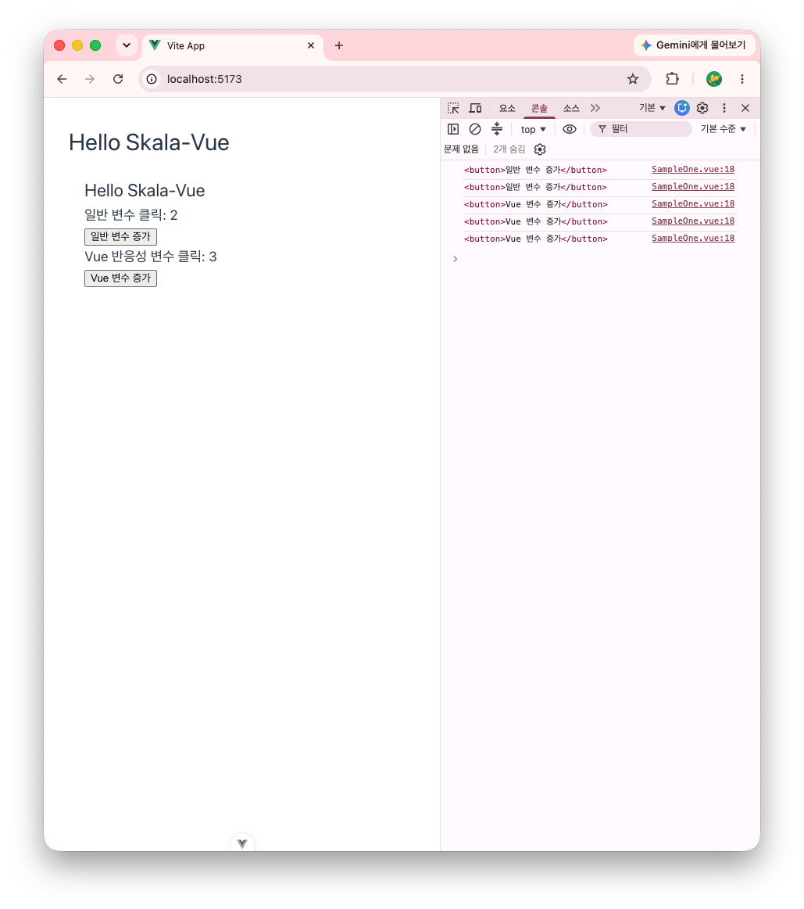

# skala-vue

## 학습환경 구성

### 1. 반응형 데이터 예제

#### 1-1. 학습 목표

일반 변수와 반응성 변수의 차이점을 이해한다.

#### 1-2. 작업 파일

- src/App.vue
- src/components/practices/basic/SampleOne.vue

#### 1-3. 결과 화면

1. 최초 접속
   
1. 일반 변수 증가 버튼 2회 클릭
   
1. 반응성 변수 증가 버튼 3회 클릭
   

### 2. JavaScript 표현식을 Text Interpolation에 사용

#### 2-1. 학습 목표

Text Interpolation에서 JavaScript Expressions (JavaScript 표현식)을 사용할 수도 있다.

#### 2-2. 작업 파일

- src/App.vue
- src/components/practices/basic/SampleTwo.vue

#### 2-3. 결과 화면

1. 자바스크립트 표현식 출력 화면
   
